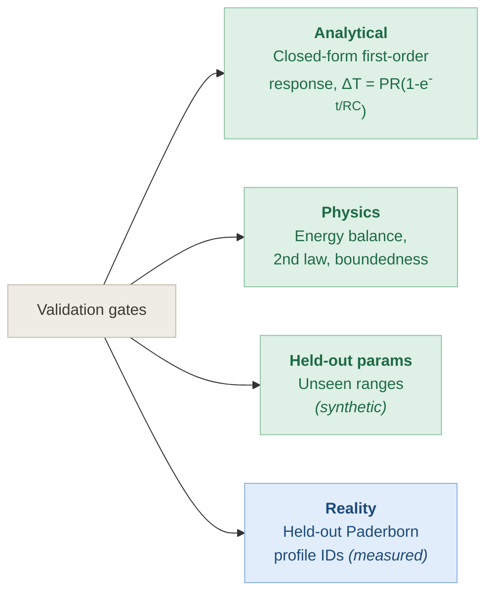

# Physics-Grounded Motor Thermal World Model

A lumped-parameter thermal network for a permanent-magnet synchronous motor, in
which every parameter traces to a published source, the learned model is trained
against multi-step rollouts rather than single steps, and the result is validated
against **real test-bench measurements** — not against the simulator that
generated its own training data.

> **Status: in progress.** Step 1 of 7 complete (`docs/PHYSICS.md`). Nothing is
> trained or validated yet. See [Build order](#build-order).

---

## The pipeline

```mermaid
flowchart TD
    A["<b>Published property values</b><br/>Conductivity, density, heat capacity"]
    B["<b>Randomized simulator</b><br/>Sample params per episode"]
    C["<b>Trajectory dataset</b><br/>Split: train, val, test"]
    D["<b>Rollout training loop</b><br/>Predict N steps, not one"]
    E["<b>Error correction</b><br/>Drift penalty, early stopping"]
    F["Three validation gates"]
    G["<b>Analytical check</b><br/>Match known solutions"]
    H["<b>Physics check</b><br/>Energy must balance"]
    I["<b>Held-out check</b><br/>Unseen parameter ranges"]

    A --> B --> C --> D --> E
    E -->|"&#8635; repeat"| D
    E --> F
    F --> G
    F --> H
    F --> I

    classDef source fill:#fbece7,stroke:#d9a08c,color:#8c3a1e
    classDef learn  fill:#eceaff,stroke:#a9a0e0,color:#33308c
    classDef gate   fill:#efece6,stroke:#c3bdae,color:#3d3a33
    classDef check  fill:#dff0e6,stroke:#8fc4a6,color:#1e6b45
    class A,B source
    class C,D,E learn
    class F gate
    class G,H,I check
```



### One gap in that diagram, stated plainly

The third gate as drawn — *held-out check, unseen parameter ranges* — is still
**synthetic**. Holding out parameter ranges tests generalisation across the
simulator's own assumptions; it does not test whether those assumptions describe
a real motor. On its own it leaves the project circular in exactly the way this
rebuild exists to fix.

So the third gate is widened to a **Reality gate** against measured hardware,
with the held-out-parameter check retained as a fourth, weaker test:



Only the blue gate can falsify the physics. The other three can only confirm
that the code is self-consistent.

---

## Why this repo exists

A thermal model is circular when a hand-written RC network generates synthetic
data and a neural network is then trained to reproduce that same network's
output. The result predicts the model, not the motor. Every metric looks
excellent and none of them mean anything, because the only thing being measured
is whether one piece of code can imitate another.

Breaking the circle needs three things, and all three are load-bearing:

| | What it fixes |
|---|---|
| **Sourced parameters** | Values come from material tables and geometry, not from what made the fit look good |
| **Multi-step rollout training** | Single-step loss is trivially easy and hides drift, which is the failure mode that matters |
| **Validation on measured data** | The only test that can prove the physics wrong rather than confirm the code agrees with itself |

---

## Build order

Each step is reviewed before the next begins.

| # | Step | Output | State |
|---|---|---|---|
| 1 | Physics derivation | `docs/PHYSICS.md` | **done** |
| 2 | Sourced parameters | `params/thermal_params.yaml` | pending |
| 3 | LPTN simulator + analytical & physics gates | `src/lptn.py`, `tests/` | pending |
| 4 | Domain-randomized data generation | `src/generate.py` | pending |
| 5 | Rollout training loop with error correction | `src/train.py` | pending |
| 6 | Paderborn fitting + held-out validation | `src/identify.py` | pending |
| 7 | Honest reporting | `REPORT.md` | pending |

Deliberately not written first: the training loop. A learned model on top of an
unsourced simulator inherits every error in it and adds its own.

---

## Model structure

Four capacitive nodes; coolant and ambient are **boundary conditions, not
nodes**:

```
                  ambient (BC)
                       |
                    [housing] ---- coolant (BC)
                       |
                 [stator yoke]
                       |
              [stator winding]
                       :
                   air gap  <-- thermal bottleneck
                       :
            [permanent magnet / rotor]
```

Losses inject at the nodes that physically generate them: copper loss into the
winding, iron loss into the yoke, magnet eddy loss into the rotor, friction and
windage into the housing and bearings.

---

## Documents

- [`docs/PHYSICS.md`](docs/PHYSICS.md) — first-principles derivation of every
  loss mechanism and heat path, the governing balance, and what a lumped model
  structurally cannot capture.

---

## Data

[Paderborn University LEA electric motor temperature dataset](https://www.kaggle.com/datasets/wkirgsn/electric-motor-temperature)
— ~185 h of PMSM test-bench measurements at 2 Hz, with thermocouple readings for
stator yoke, stator tooth, stator winding and permanent magnet.

Fitting uses a subset of profile IDs; **entire profile IDs are held out** for
testing. Splitting by timestep would leak, because adjacent samples at 2 Hz are
nearly identical.

Not yet downloaded — see the questions at the end of the build log.

---

## References

1. Boglietti, Cavagnino, Staton, Shanel, Mueller, Mejuto — *Evolution and Modern
   Approaches for Thermal Analysis of Electrical Machines*, IEEE Trans. Ind.
   Electron. **56**(3):871–882, 2009.
2. Wallscheid & Böcker — *Global Identification of a Low-Order Lumped-Parameter
   Thermal Network for Permanent Magnet Synchronous Motors*, IEEE Trans. Energy
   Convers. **31**(1):354–365, 2016.
3. Wallscheid & Böcker — *Design and Identification of a Lumped-Parameter
   Thermal Network for PMSMs Based on Heat Transfer Theory and Particle Swarm
   Optimisation*, EPE 2015.
4. Boglietti, Carpaneto, Cossale, Vaschetto — *Stator-Winding Thermal Models for
   Short-Time Thermal Transients*, IEEE Trans. Ind. Electron. **63**(5):2713–2721, 2016.
5. Mellor, Roberts, Turner — *Lumped parameter thermal model for electric
   machines of TEFC design*, IEE Proc. B, 1991.
6. Kirchgässner, Wallscheid, Böcker — *Estimating Electric Motor Temperatures
   with Deep Residual Machine Learning*, IEEE Trans. Power Electron.
   **36**(7):7480–7488, 2020.
7. Kirchgässner, Wallscheid, Böcker — *Thermal Neural Networks: Lumped-Parameter
   Thermal Modeling with State-Space Machine Learning*, arXiv:2103.16323.
8. Bergman, Incropera, DeWitt, Lavine — *Fundamentals of Heat and Mass Transfer*.
